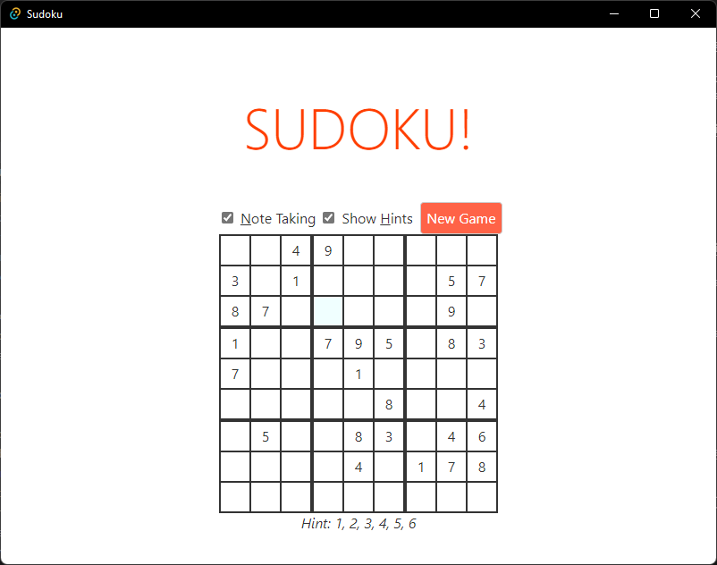

# Sudoku

This is a standard Sudoku game written in [Rust](https://rustlang.org) with a [Svelte.js](https://svelte.dev) user interface hosted in [Tauri](https://tauri.studio/en).

I like playing Sudoku, and there are lots of apps to choose from on any platform. I wrote this one as a learning exercise, and to explore solving strategies and gameplay mechanics. It also seemed like a good sample to write with Tauri, since the UI is simple enough that I could implement it as my first Svelte project, and the solver and generator are CPU bound and potentially parallelizable, so they can benefit from async Rust.

There are off-the-shelf Rust [crates](https://crates.io/search?q=sudoku) for Sudoku, many of which are much more sophisticated including the simply named [sudoku](https://crates.io/crates/sudoku). The one I wrote will probably never be published on [crates.io](https://crates.io), it just needs to be good enough for experimentation.

## Get started

Install the Tauri [pre-requisites](https://tauri.studio/en/docs/getting-started/intro) for your target platform.

To run in dev/debug mode, follow the instructions under [Start Tauri Development Window](https://tauri.studio/en/docs/usage/development/development#2-start-tauri-development-window). Tauri is configured to start the development web server automatically when you start the app in dev mode, and on most platforms it will automatically shut it down when you explicitly close the app. While running in this mode, changes you make to the [./src/...](./src/) will perform a hot reload of the Svelte project content, and changes that you make in [./src-tauri/...](./src-tauri/) will close the app, perform an incremental Rust build, and restart the app.

If you want to install the app locally, follow the instructions under [Bundle your application with Tuari](https://tauri.studio/en/docs/usage/development/publishing#2-bundle-your-application-with-tauri). This should create an app package that you can install on your machine.
